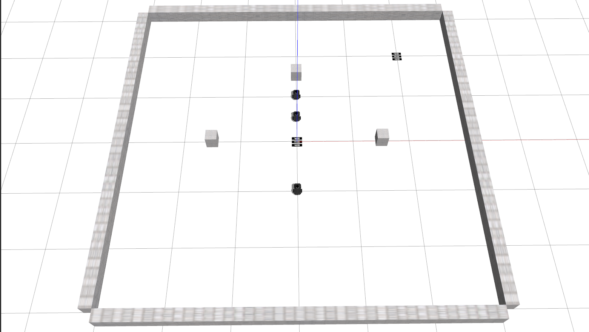

# Safe RL using DDR Robots in Gazebo Simulation

- 任务：将CBF结合进actor网络中，然后再通过critic更新
- 有不同branch分支

> 2022.03--

## Environments

- 将整个IEEE_TAI_DDR功能包放到ros工作空间中，并编译和source

  ```bash
  cd ~/ros_ws/
  catkin_make
  source devel/setup.sh
  ```

- **将ddr_gazebo/models下的model文件全部放到home目录下：~/.gazebo/models/**

- 运行

  ```bash
  roslaunch ddr_control ddr_wall.launch
  ```

  打开环境，正常打开后应该会有如下界面：

  

- 目录`ddr_control/scripts/envs`下有两个环境，其中`test_safe_env.py`文件计划用于训练完成后测试使用（往返到达目标点）；`train_safe_env.py`
  文件用于训练使用，任务为不被碰撞的到达目标点，目标点随机给定，agent初始位置也随机给定。只有所有agent都到达目标点后才会done，否则任一agent到达目标点后只会重置该agent的初始状态，不影响其他agent。运行任意`env`
  文件都可以进行简单测试：

  ```bash
  python test_env.py
  # or
  python train_env.py
  ```

## algos

- 运行`scripts/algos`下的`main_safe.py`开始训练或者测试，具体说明可参看对应文件夹下的`file_explain.py`
