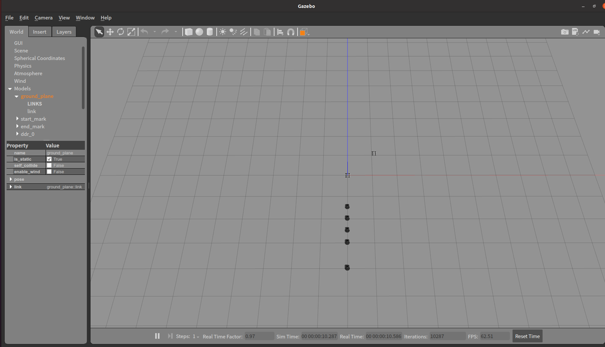

# Safe RL using DDR Robots in Gazebo Simulation

- 任务：将CBF结合进actor网络中，然后再通过critic更新
- 有不同branch分支

> 2022.03开始

## Environments

- 将整个IEEE_TAI_DDR功能包放到ros工作空间中，并编译和source

  ```bash
  cd ~/ros_ws/
  catkin_make
  source devel/setup.sh
  ```

- **将ddr_gazebo/models下的model文件全部放到home目录下：~/.gazebo/models/**

- 运行

  ```bash
  roslaunch ddr_control robotarium.launch
  ```

  打开环境，正常打开后应该会有如下界面：

  

- 目录`ddr_control/scripts/envs`下有两个环境，其中`ros_robotarium_env`环境用来测试clf-cbf-mpc，`rl_ros_robotarium_env`用来测试rl+CBF算法。

## algos

### 1. clf_cbf_nmpc_test

进入`clf_cbf_nmpc_test`文件夹，运行`test.py`文件，则直接测试clf-cbf-mpc算法。

### 2. robotarium_ros_rl_cbf

进入`robotarium_ros_rl_cbf`文件夹

- 运行`ros_rl_main.py`文件，进行算法的训练，使用的是ros环境。
  ```shell
  python ros_rl_main.py --cuda --eval False
  ```
  测试：
  ```shell
  python ros_rl_main.py --cuda --mode test --resume ./output/...  --visualize
  ```
- 运行`main.py`文件，进行算法的训练，使用的是robotarium环境。
  ```shell
    python main.py --cuda --eval False
  
  ```
  测试：
  ```shell
  python main.py --cuda --mode test --resume ./output/...  --visualize
  ```
- 运行`test_robotarium.py`文件，进行CBF测试，使用的是robotarium环境。
